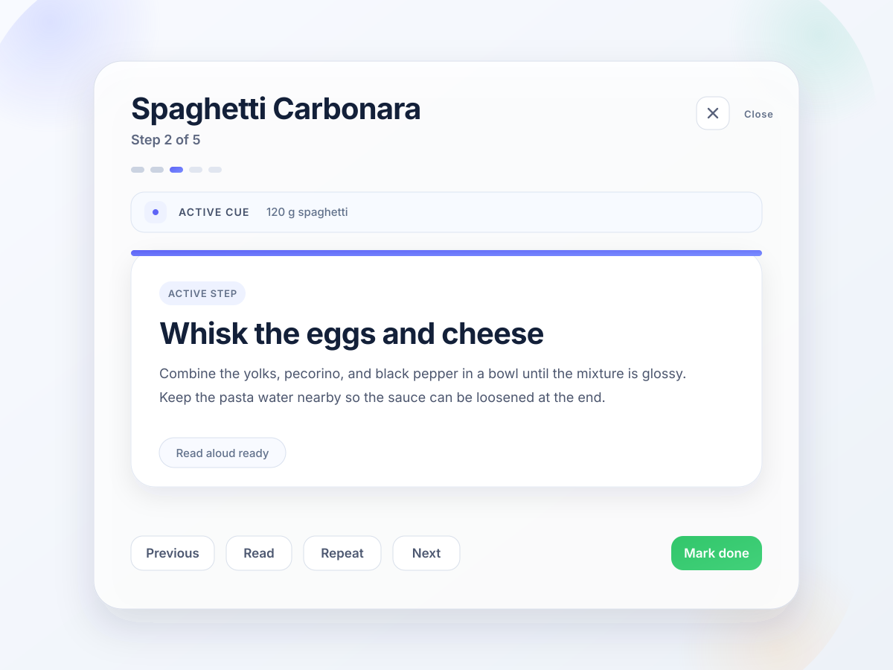

# Stepwise

Stepwise is a small Swift package for displaying sequential instructions in Apple apps. It provides a shared step model, focused SwiftUI presentation primitives for card/list/rail layouts, validation helpers, and optional extraction scaffolding for converting plain text into validated steps.

## What Stepwise is

Stepwise is a reusable model and UI layer for recipes, setup flows, checklists, onboarding, film development routines, and other ordered instructions.

## When to use it

Use Stepwise when an app needs a stable sequence of human-readable steps, optional timing, validation, normalization, and Apple-native SwiftUI presentation.

## When not to use it

Do not use Stepwise as a workflow engine, persistence layer, automation framework, full app shell, or domain-specific recipe or film database. Apps own their persistence, business rules, timers, and domain models.

## Installation

Add Stepwise with Swift Package Manager:

```swift
.package(url: "https://github.com/mitchins/stepwise.git", from: "0.1.0")
```

Then depend on the products you need:

```swift
.product(name: "StepwiseCore", package: "Stepwise")
.product(name: "StepwiseUI", package: "Stepwise")
.product(name: "StepwiseFoundationModel", package: "Stepwise")
```

## Quick start

```swift
import StepwiseCore
import StepwiseUI

let document = StepDocument(
    title: "Equipment setup",
    sections: [
        StepSection(
            title: "Prepare",
            steps: [
                Step(title: "Open the kit", detail: "Place each item on a clean surface."),
                Step(title: "Connect the cable", icon: StepIconHint(symbolName: "cable.connector")),
                Step(title: "Wait 30 sec", kind: .timer, duration: .seconds(30))
            ]
        )
    ]
)

StepFlowView(document: document)
```

## Focused presentation



Stepwise provides the step model and presentation primitives. Apps keep their own timers, domain state, persistence, and controls.

## Data model

The core model lives in `StepwiseCore` and is independent of SwiftUI:

- `StepDocument`
- `StepSection`
- `Step`
- `StepKind`
- `StepState`
- `StepDuration`
- `StepTimer`
- `StepIconHint`
- `StepWarning`

Steps are `Codable`, `Equatable`, `Identifiable`, and `Sendable` where appropriate. Apps can store state on each `Step`, or keep completion/skipped IDs separately and derive view state with `stateMap`.

See `docs/DataModel.md`.

## SwiftUI views

SwiftUI views live in `StepwiseUI` and depend on `StepwiseCore`. Available views include:

- `StepCardView`
- `StepRowView`
- `StepListView`
- `StepFlowView` / `StepPagerView` for convenience/demo composition
- `StepProgressDots`
- `StepSectionHeaderView`
- `StepCompletionView`
- `StepRailView`
- `WatchStepRailView`

Use `StepwiseTheme` to set tint, done, warning, spacing, corner radius, and icon style. The default style uses Apple-native system colors, Dynamic Type, SF Symbols by name, and accessible labels. `StepFlowView` / `StepPagerView` is a convenience/demo composition for shells that already match the Stepwise layout; serious integrations should compose from smaller primitives.

See `docs/UI.md`.

## Integrating into an existing app

Stepwise works best as the focused presentation layer inside an existing app. Keep timers, ingredients, batching, voice controls, persistence, diagnostics, and other domain-specific state outside Stepwise.

- Use `StepCardView`, `StepProgressDots`, and the smaller row/list primitives when you want exact control over the presenter shell.
- Avoid duplicated current-step summaries, engine lights, debug panels, and full step lists in presenter mode.
- Surface compact current-step metadata only when it adds signal.
- Treat `StepFlowView` as a convenience/demo composition, not the required shell.

```swift
import SwiftUI
import StepwiseCore
import StepwiseUI

struct FocusedStepPresenter: View {
    let title: String
    let activeStep: Step
    let activeIndex: Int
    let totalCount: Int
    let completedCount: Int
    let onPrevious: () -> Void
    let onNext: () -> Void
    let onPrimaryAction: () -> Void
    let onClose: () -> Void
    let onRead: (() -> Void)?
    let onRepeat: (() -> Void)?

    var body: some View {
        VStack(alignment: .leading, spacing: 16) {
            HStack {
                Text(title)
                Spacer()
                Button("Close", action: onClose)
            }

            StepProgressDots(
                total: totalCount,
                currentIndex: activeIndex,
                completedCount: completedCount
            )

            StepCardView(
                step: activeStep,
                index: activeIndex,
                total: totalCount,
                actionTitle: "Mark done",
                action: onPrimaryAction
            )

            HStack {
                Button("Previous", action: onPrevious)
                Spacer()
                if let onRead {
                    Button("Read", action: onRead)
                }
                if let onRepeat {
                    Button("Repeat", action: onRepeat)
                }
                Button("Next", action: onNext)
            }
        }
    }
}
```

## Future API idea

A focused presenter primitive could reduce boilerplate for apps that want Stepwise to provide the centered shell without taking over the whole app mode.

```swift
StepPresentationView(
    document: document,
    currentStepID: currentStepID,
    mode: .focused,
    onPrevious: ...,
    onNext: ...,
    onPrimaryAction: ...
)
```

This is a future direction, not a shipping API.

## Validation and normalization

Validation and normalization helpers live in `StepwiseCore`.

```swift
let normalized = StepNormalizer().normalize(document)
let report = StepValidator().validate(normalized)
```

Validation catches empty documents, empty sections, empty titles, overlong titles, adjacent duplicates, obvious multi-action steps, ambiguous durations, model-commentary leakage, missing timers, and invalid current-state ordering. Normalization trims whitespace, removes `Step 1:` prefixes, safely sentence-cases all-caps titles, detects simple durations, and avoids false precision for ambiguous timing.

See `docs/Validation.md`.

## Optional Foundation Model extraction

Extraction scaffolding lives in `StepwiseFoundationModel`. The core package does not depend on Foundation Model APIs, and the UI package does not depend on extraction.

```swift
import StepwiseFoundationModel

let prompts = StepPromptSet.build(
    input: "Rinse rice. Wait 5 min.",
    configuration: StepExtractionConfiguration(domain: .recipe)
)
```

The target provides a protocol, prompt/schema builders, deterministic JSON parsing, validation, repair prompt hooks, mocks, and an availability-gated placeholder for future SDK integration. It does not claim real Foundation Model runtime behavior in this environment.

See `docs/Extraction.md`.

## Examples

Examples are in `Examples/`:

- `GenericChecklist.swift`
- `RecipeFlow.swift`
- `FilmDevelopmentFlow.swift`

## Platform support

Stepwise targets iOS 17, macOS 14, and watchOS 10 or newer. The package is Swift 6-friendly and uses Swift Package Manager.

## Design principles

Stepwise prefers simple APIs, native platform conventions, Dynamic Type, accessible labels, system colors, and consumer-owned app state.

## Contributing

See `CONTRIBUTING.md`.

## License

Stepwise is available under the MIT License. See `LICENSE`.
